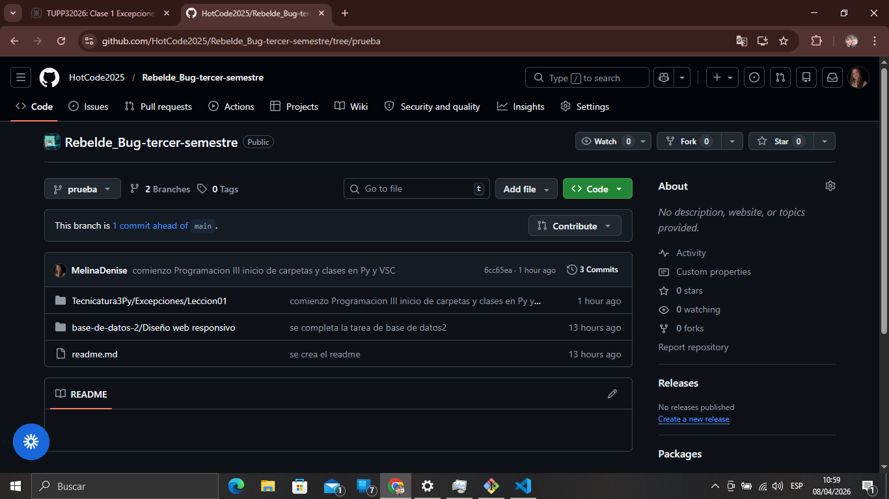
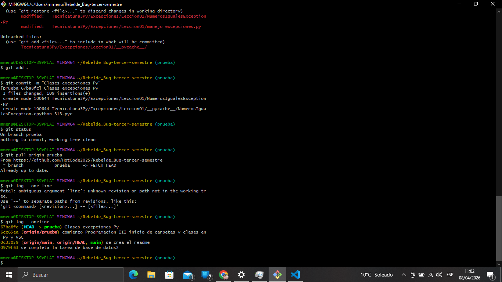

# 📌 Trabajo Final - Metodología Scrum

## 🏫 Equipo
Rebelde Bug

## 👨‍🏫 Profesor
Ariel Betancud

## 👥 Integrantes
- Melina Gallo
- Ruben Marchisio
- Zoe Garnica
- Micaela Cynthia Aramayo
- José Cueva Arévalo
- Maximiliano Foglia
- Jimena Karin Pérez
- Ivana Molina

---

## 📖 Introducción

Este proyecto consiste en el desarrollo de la metodología ágil Scrum para organizar el trabajo en equipo y mejorar la productividad.

---

## ⚙️ ¿Qué es Scrum?

Scrum es una metodología ágil que permite organizar el trabajo en equipo mediante tareas divididas en iteraciones, promoviendo la colaboración, la adaptación y la mejora continua.

---

## 👨‍💻 Organización del equipo

El equipo está conformado por 8 integrantes.

El trabajo se adapta según la disponibilidad de cada integrante.

Ponemos en común las tareas, compartimos ideas y soluciones. Respecto a ladisponibilidad es quien vuelca la lluvia de ideas al aplicativo y el envío al profesor. Somos un equipo comprometido y equitativo.

Rubén en particular es quien verifica no existan conflictos en las ramas de Git Hub.
Según experiencia de todos el año pasado, este año decidimos que exista una única rama de prueba, en lugar de intentar cadac uno tener una rama prueba, para despues mergear a prubea y finalmente a main.

---

## 🛠️ Herramientas utilizadas

- Git
- GitHub
- Visual Studio Code
- Python

---

## 🔄 Metodología de trabajo

El equipo trabaja de forma colaborativa utilizando un repositorio compartido.

Antes de comenzar a trabajar, se actualiza el repositorio para evitar conflictos.

Las tareas son distribuidas y luego integradas en una rama común del proyecto.

---

## ⚠️ Problemas encontrados

- Conflictos al trabajar en la misma rama
- Diferencias en tiempos de trabajo entre integrantes, que se charlan previo a distribucion de tareas. Se plantean las tareas y cada uno se postula a lo que puede cumplir. El que se postula, CUMPLE.

---

## ✅ Soluciones implementadas

- Mejor organización del equipo
- Comunicación constante
- Actualización del repositorio antes de subir cambios

---

## 🎯 Conclusión

La metodología Scrum permite mejorar la organización del equipo, optimizar los tiempos y facilitar el trabajo colaborativo.

---

## Semana 06/04/26 al 10/04/26

Día Lunes, primer clase Programación III, todos realizamos asistencia, luego conexión al vivo, comentarios de reencuentro. Camila Scheurer no continuará por problemas personales, ya no está ni en la facultad ni en el grupo.
Rubén ofrece crear repositorio, Melina aporta según comentario del profesor de llame 3er semestre.
Jimena y Maximiliano desarrollan y consultan UML con el grupo, plantean entrega para lograrla antes de las 23hrs.
José y Zoe aportan también.

Día Martes Base de Datos II
Grupo realiza asistencia, Liva aporta ideas, Melina aporta actividad 2, Rubén consulta entrega y pone en común Actividad 1 y 2 para que grupo confirme y corrija de ser necesario.
Grupo concuerdan todos en realizar la entrega. Se entrega en tiempo y forma.

Día Miércoles
Melina temprano avisa que hará uso del repositorio para suba de clases Py, Rubén sugiere que mantengamos una única rama prueba. Queda repositorio disponible para que grupo pueda continuar aportando.
Profe indica que no enviamos UML via repositorio, postergamos presentación para el Lunes, habiamos comprendido la entrega del diagrama como .uxf pero no como .js

Día Jueves
Asistencia y clase de Inglés

Día Viernes
Coordinamos corrección de diagrama UML reconocemos diferencias de lenguajes corregimos errores en el diagrama UML como nombres de clases, herencia y responsabilidades.
Luego se implementó el sistema en JavaScript aplicando POO.
Se utilizó herencia para evitar duplicación de código y composición para representar que una computadora está formada por varios componentes.
Además, la clase Orden permite agrupar computadoras como si fuera un pedido.
El archivo .js representa la versión corregida y funcional del sistema, que vamos a exponer oralmente el día Lunes.
Mica aporta el diagrama UML al repo para que lo corrijamos en base al trabajo de Maxi y Jime. Rubén y Melina aportan al repo al cual también van a sumar trabajos de clase Java Ivana y José.

## Semana 13/04/26 al 17/04/26

Día Lunes
Presentamos trabajo y corrección de clases del día Lunes 6/04 y exposicion Miércoles 08/04

## 📎 Anexos (a agregar)

- Capturas del repositorio

- Commits realizados
