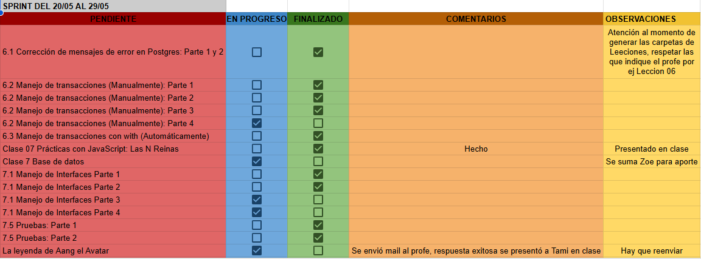
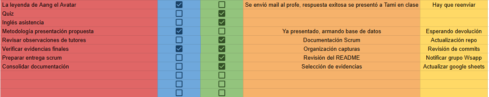
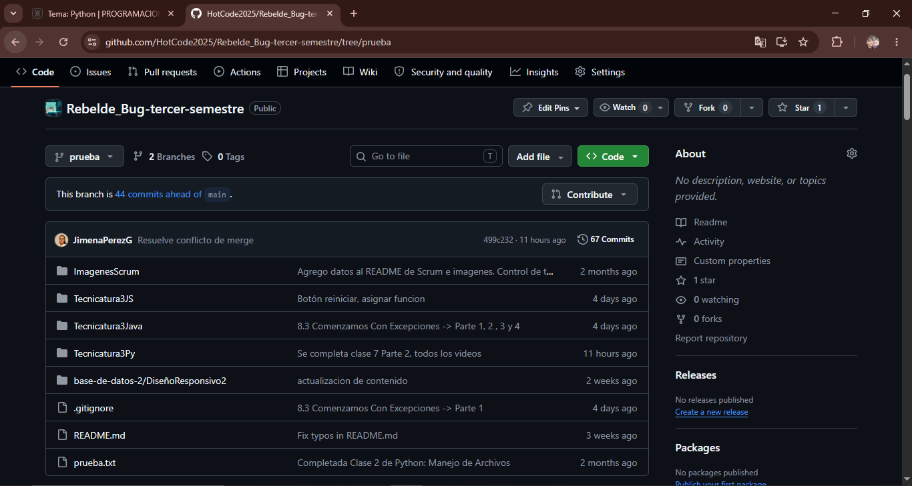
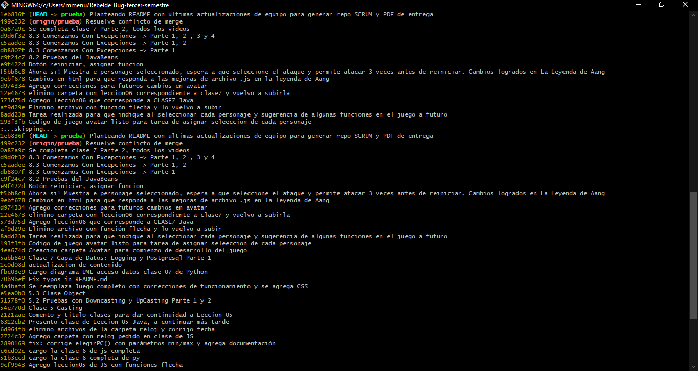
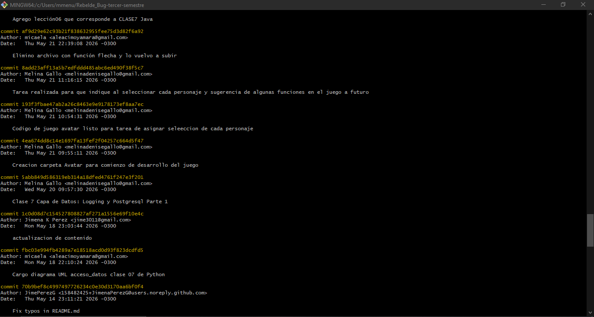
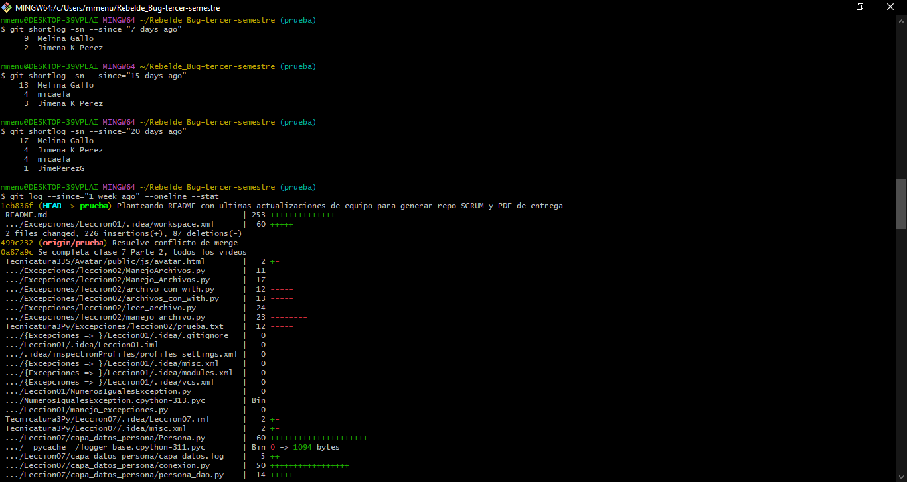

# 📌 TRABAJO FINAL – METODOLOGÍA SCRUM

## 👨‍🏫 Profesor

Ariel Betancud

## 👥 Equipo

Rebelde Bug

# 👥 Evolución del Equipo

El equipo **Rebelde Bug** inició sus actividades académicas del año 2026, tercer semestre, con ocho integrantes:

* Melina Gallo
* Rubén Marchisio
* Zoe Garnica
* Micaela Cynthia Aramayo
* José Cueva Arévalo
* Maximiliano Foglia
* Jimena Karin Pérez
* Ivana Molina

Durante el desarrollo del cuatrimestre algunos integrantes dejaron de participar activamente por distintos motivos académicos y personales.

Como parte del proceso de adaptación del equipo, y siguiendo los principios ágiles de Scrum, las responsabilidades fueron reorganizadas para garantizar la continuidad de las actividades y el cumplimiento de los objetivos propuestos.

Hacia finales de Mayo y durante la etapa de cierre del semestre, las tareas de organización, seguimiento, documentación, coordinación y entrega fueron asumidas principalmente por:

* Jimena Karin Pérez
* Micaela Cynthia Aramayo
* Melina Gallo

La comunicación constante, la colaboración y la distribución compartida de responsabilidades permitieron mantener el avance de los trabajos grupales y cumplir con las entregas previstas.

# 📖 Introducción

El presente trabajo tiene como objetivo mostrar la aplicación de la metodología Scrum durante una semana de trabajo del equipo Rebelde Bug.

Durante el desarrollo del cuatrimestre utilizamos herramientas de trabajo colaborativo para organizar tareas, realizar entregas y mantener actualizado el repositorio compartido del grupo.

# 🛠️ Herramientas Utilizadas

* Git
* GitHub
* Visual Studio Code
* JavaScript
* Python
* WhatsApp
* Google Drive

Estas herramientas permitieron coordinar el trabajo colaborativo, compartir avances y mantener un control de versiones adecuado durante el desarrollo de las actividades.

# 🔄 Aplicación de Scrum

Durante el trabajo se aplicaron principios de Scrum adaptados al contexto académico.

## 👨‍💻 Organización del Equipo

Las tareas fueron distribuidas según la disponibilidad y conocimientos de cada integrante.

Antes de comenzar una actividad se definían los objetivos a cumplir y posteriormente se realizaba una puesta en común para verificar avances, detectar dificultades y corregir errores.

La comunicación permanente permitió reorganizar responsabilidades cuando algunos integrantes dejaron de participar activamente.

## 📅 Daily Scrum

La comunicación diaria se realizó principalmente mediante WhatsApp.

En estas conversaciones se compartía:

* Qué tareas se habían completado.
* Qué actividades estaban en proceso.
* Qué dificultades surgían.
* Qué ayuda necesitaba cada integrante.
* A través de un google docs, ir marcando tareas y/o consignas cumplidas.

## ✅ Sprint Review

Las entregas y exposiciones realizadas durante las clases funcionaron como instancias de revisión.

A partir de las observaciones del docente y tutores, se realizaron correcciones y mejoras en los trabajos presentados.

## 🔍 Sprint Retrospective

Luego de detectar conflictos al trabajar sobre diferentes ramas del repositorio en el semestre pasado, año 2025, el equipo decidió simplificar la estrategia de trabajo utilizando una única rama de pruebas antes de fusionar los cambios a la rama principal.

Esta decisión redujo errores y facilitó la integración del trabajo realizado por distintos integrantes, exigiendo también responsabilidad de los pull, comunicación sobre tiempos de trabajo en el repositorio, colaboración y consciencia de metodología.

# 🚀 Semana de Trabajo Seleccionada

## Sprint – Semana del 25 al 29 de Mayo de 2026

### 🎯 Objetivos del Sprint

* Organizar las entregas pendientes.
* Verificar el estado de los trabajos grupales.
* Mantener actualizado el repositorio.
* Coordinar responsabilidades entre las integrantes activas.
* Preparar documentación y evidencias para las entregas finales.

## 📌 Lunes

Se realizó una revisión general de las tareas pendientes del grupo.

Las integrantes activas verificaron el estado de los trabajos entregados y aquellos que requerían correcciones.

También se revisó el repositorio para confirmar que todos los cambios estuvieran correctamente registrados.

## 📌 Martes

Se distribuyeron actividades según disponibilidad horaria.

Se revisaron archivos compartidos y se actualizaron documentos que formaban parte de las entregas finales.

La comunicación se mantuvo mediante mensajes grupales para coordinar avances.

## 📌 Miércoles

Se verificó el historial de commits del repositorio.

Se analizaron los aportes realizados durante el cuatrimestre y se seleccionaron evidencias para documentar el trabajo colaborativo.

También se revisó la organización de carpetas y archivos.

## 📌 Jueves

Se realizó seguimiento de las actividades pendientes.

Se completaron correcciones menores y se preparó la documentación final para su presentación.

Las integrantes compartieron observaciones y realizaron una revisión conjunta del material.

## 📌 Viernes

Se efectuó la revisión final del trabajo.

Se verificó que todas las evidencias estuvieran correctamente incorporadas y que la documentación reflejara el proceso de trabajo realizado por el equipo.

Finalmente se dejó preparada la entrega correspondiente.

# ⚠️ Problemas Encontrados

Durante el desarrollo del proyecto surgieron diversas dificultades:

* Reducción progresiva de integrantes activos.
* Diferencias en la disponibilidad horaria.
* Conflictos ocasionales al trabajar sobre algún proyecto y definirlo.
* Necesidad de reorganizar tareas durante el cuatrimestre.

# ✅ Soluciones Implementadas

Para afrontar estas dificultades se adoptaron las siguientes medidas:

* Redistribución de responsabilidades.
* Comunicación constante entre integrantes.
* Revisión periódica de avances.
* Uso de GitHub para control de versiones.
* Simplificación de la estrategia de ramas del repositorio.

# 📈 Resultados Obtenidos

La aplicación de prácticas basadas en Scrum permitió:

* Mejor organización de las actividades.
* Seguimiento de tareas pendientes.
* Trabajo colaborativo más eficiente.
* Mayor control sobre las versiones de los proyectos.
* Adaptación frente a cambios en la composición del equipo.

# 📎 Evidencias

# 📋 Tablero Kanban

Para el seguimiento de actividades del Sprint se utilizó una hoja compartida de Google Sheets adaptada al enfoque Kanban.

Las tareas fueron organizadas según su estado de avance en las categorías Pendiente, En Progreso y Finalizado, permitiendo visualizar el progreso del trabajo y coordinar las actividades del equipo durante el desarrollo del semestre.

## Repositorio GitHub

## Historial de Commits

# 🎓 Conclusión

La experiencia permitió aplicar conceptos de la metodología Scrum en un entorno académico, favoreciendo la organización, la comunicación y el trabajo colaborativo.

A pesar de los cambios en la composición original del equipo, fue posible reorganizar responsabilidades y continuar avanzando hacia los objetivos planteados.

El uso de herramientas como Git y GitHub resultó fundamental para coordinar tareas, registrar avances y mantener un historial del trabajo realizado durante el cuatrimestre.

Finalmente, la experiencia permitió comprender la importancia de la planificación, la adaptación al cambio y la colaboración continua, principios fundamentales de la metodología Scrum.
