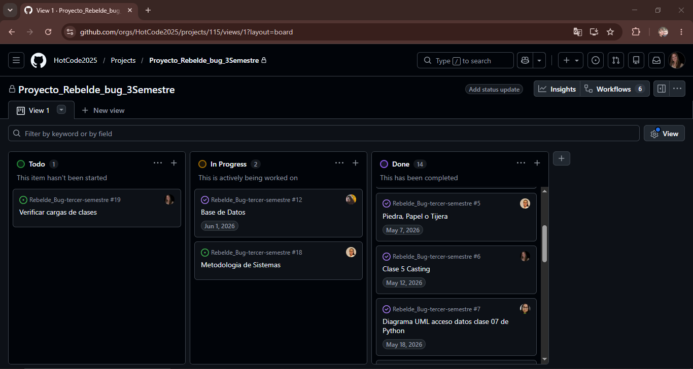

# 📌 TRABAJO FINAL – METODOLOGÍA SCRUM

## 👨‍🏫 Profesor
Ariel Betancud

## 👥 Equipo
Rebelde Bug

---

# 👥 Evolución del Equipo

El equipo **Rebelde Bug** inició sus actividades académicas del año 2026, correspondiente al tercer semestre, con una estructura de ocho integrantes:

* Melina Gallo
* Rubén Marchisio
* Zoe Garnica
* Micaela Cynthia Aramayo
* José Cueva Arévalo
* Maximiliano Foglia
* Jimena Karin Pérez
* Ivana Molina

A lo largo del cuatrimestre, por diversos motivos académicos y personales de fuerza mayor, varios compañeros debieron abandonar el cursado activo. Quienes quedamos asumimos el desafío. 

Siguiendo los principios ágiles fundamentales de Scrum (Inspección y Adaptación), reorganizamos el flujo completo de trabajo. Hacia finales de Mayo y durante la etapa crítica de cierre del semestre, las tareas de programación, control de versiones, diseño, documentación y coordinación final fueron absorbidas con total compromiso por el núcleo remanente:

* **Jimena Karin Pérez**
* **Micaela Cynthia Aramayo**
* **Melina Gallo**
* **Zoe Geraldine Garnica**

Este informe es el reflejo honesto de esas vicisitudes y de cómo la comunicación constante por canales alternativos nos permitió mantener a flote el proyecto e integrar de forma equitativa.

---

# 📖 Introducción

El presente trabajo tiene como objetivo mostrar la aplicación real de la metodología Scrum durante el desarrollo del proyecto de tercer semestre del equipo Rebelde Bug. 

Alineados con las correcciones de nuestros tutores, tradujimos de forma transparente el registro histórico que llevábamos de manera interna al ecosistema técnico nativo de **GitHub Issues** y **GitHub Projects**. Esto nos permitió respaldar cada tarea de gestión con los commits y lo que fuimos subiendo a la plataforma.

---

# 🛠️ Herramientas Utilizadas

* **Gestión y Control de Flujo:** GitHub Projects (Tablero Kanban nativo) e Issues.
* **Control de Versiones:** Git y GitHub Repositories (Rama de pruebas).
* **Entorno de Desarrollo:** Visual Studio Code, PyCharm, NetBeans, Base de Datos.
* **Lenguajes y Tecnologías:** JavaScript, Python y Base de Datos.
* **Sincronización y Comunicación:** WhatsApp y Google Drive/Sheets (como registro complementario).

---

# 🔄 Aplicación de Scrum Adaptada al Entorno

## 👨‍💻 Organización del Equipo y Gestión de Requerimientos
Las tareas se desglosaron en el backlog técnico. Cada integrante activa se postuló de forma transparente según su disponibilidad horaria. En nuestro equipo rige una regla estricta: **el que se postula, cumple**, protegiendo el ritmo de desarrollo del Sprint.

## 📅 Daily Scrum (Sincronización Diaria)
Dada la reducción de integrantes y los horarios cruzados, la sincronización diaria se mudó a canales dinámicos como WhatsApp. En estas sesiones ágiles compartíamos:
1. Qué tareas completamos del código.
2. Qué actividades estaban en proceso dentro de la rama local.
3. Qué impedimentos o conflictos de Git surgían para resolver en conjunto.

## ✅ Sprint Review (Revisión del Incremento)
Las entregas parciales y las defensas en vivo con el docente y tutores funcionaron como nuestras instancias de revisión. Sus observaciones nos permitieron iterar y aplicar mejoras de código sobre la marcha.

## 🔍 Sprint Retrospective (Estrategia de Ramas)
Aprendiendo de los dolores de cabeza del año pasado (2025) por conflictos masivos en múltiples ramas, la retrospectiva arrojó una solución drástica y eficiente: **utilizar una única rama `prueba` común**. Cada integrante hace un `git pull` obligatorio antes de programar y unifica sus cambios en `prueba` antes de hacer el despliegue final en la rama `main`. Esto automatizó la integración y redujo los errores a cero.

---

# 🚀 Sprints Cronológicos y Asistencia Semanal
*(Fechas validadas en base a la línea temporal y los registros de entrega del proyecto)*

### Sprint 1 – Semana del 04/05 al 08/05 de 2026
* **Lunes 04/05:** Sincronización grupal para reestructurar las tareas del equipo tras las bajas sufridas. Planificación del módulo práctico.
* **Martes 05/05:** Distribución de actividades de código según disponibilidad horaria.
* **Miércoles 06/05:** Integración de archivos y control de versiones en la rama de prueba.
* **Jueves 07/05:** **Hito de Entrega:** Finalización y subida exitosa del proyecto *"Piedra, Papel o Tijera"* (Registrado en el Tablero Kanban con fecha de cierre May 7).
* **Viernes 08/05:** Balance del cierre del Sprint y revisión de código limpio.

### Sprint 2 – Semana del 11/05 al 15/05 de 2026
* **Lunes 11/05:** Apertura del Sprint y revisión de prioridades.
* **Martes 12/05:** **Hito de Entrega:** Melina efectúa la subida y cierre de la tarea *"Clase 5 Casting"* de Java (Registrado en el Tablero Kanban con fecha de cierre May 12).
* **Miércoles 13/05:** Puesta en común del avance de los scripts del proyecto integrador.
* **Jueves 14/05:** Registro de asistencia grupal y testeos cruzados de la rama prueba.
* **Viernes 15/05:** Control de pendientes y preparación para los requerimientos de la semana entrante.

### Sprint 3 – Semana del 18/05 al 22/05 de 2026
* **Lunes 18/05:** **Hito de Entrega:** Micaela realiza la entrega técnica del *"Diagrama UML acceso datos clase 07 de Python"* (Registrado en el Tablero Kanban con fecha de cierre May 18).

---

# ⚠️ Problemas Encontrados y Soluciones Implementadas

* **Reducción Progresiva del Grupo:** Pasamos de ser 8 a quedar únicamente 4 compañeras activas.
  * **Solución:** Reasignamos las tareas y los roles del backlog en GitHub Projects de manera equitativa entre nosotras, asumiendo una carga compartida para no comprometer la regularidad.
* **Diferencias Horarias:** Tiempos de trabajo asincrónicos entre las integrantes.
  * **Solución:** Centralización estricta de la información en el Tablero Kanban de GitHub para que cada una supiera el estado exacto del proyecto al conectarse, sin pisar el trabajo de otra.
* **Conflictos de Git:** Superposición de código en archivos comunes.
  * **Solución:** Adopción de la rama única de pre-producción (`prueba`) combinada con alertas rápidas por WhatsApp antes de realizar un `git push`.

---

# 📊 Resultados Obtenidos

La migración a las herramientas nativas de GitHub nos permitió:
* Centralizar la gestión del proyecto sin depender de aplicativos externos.
* Visualizar en tiempo real el progreso mediante el flujo Kanban (*Todo*, *In Progress*, *Done*).
* Vincular de forma transparente la documentación teórica con las evidencias de código de la terminal.

---

# 📎 Evidencias Técnicas y Anexos

### 1. Tablero Kanban Scrum (GitHub Projects - Vista Board)
Interfaz visual que documenta las tareas completadas por las integrantes activas y los requerimientos actualmente en curso (*Base de Datos* y *Metodología*):

### 2. Estructura de la Rama de Desarrollo (Prueba)
Validación del entorno de trabajo unificado implementado por el equipo para evitar conflictos:

### 3. Registro Histórico de Commits Generales
Evidencia del código fuente subido y distribuido de forma equitativa por las integrantes del grupo:

### 4. Logs e Historial de la Terminal
Capturas de consola que certifican la trazabilidad técnica del proyecto:

---

# 🎓 Conclusión

Esta experiencia académica nos permitió vivir la esencia real del agilismo: **Scrum no es un marco rígido, es una herramienta para abrazar el cambio**. A pesar de haber perdido a la mitad del equipo original durante el cuatrimestre, la reestructuración interna, la disciplina en el control de versiones y el uso del tablero Kanban nativo de GitHub nos permitieron suplir las bajas con organización. Logramos consolidarnos como un equipo resiliente, coordinado y técnicamente eficiente, alcanzando los objetivos del tercer cuatrimestre en tiempo y forma.

